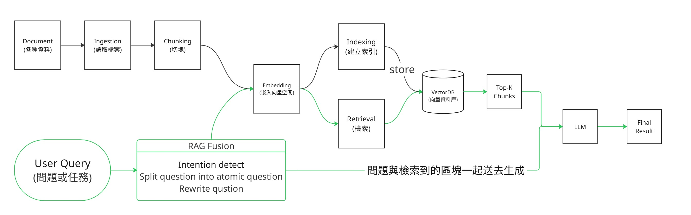

# Stage 6 — Memory · RAG · Context Engineering

> [繁體中文](./06-memory-rag.md) | [简体中文](./06-memory-rag.zh-Hans.md) | **English**

⏱ **Estimated time**: 2 weeks (approx. 10 hours)

> 💡 This stage is dense with terminology (**RAG / vector database / embedding / chunking / hybrid search / reranking…**). If you're unfamiliar, first check out [`resources/glossary.en.md` §3](../resources/glossary.en.md#3-memory--retrieval--rag).

> 📋 **Chapter structure**: What is Context Engineering (positioning) + Concept comparison tables ×2 → Learning Objectives → Entry Conditions → Required Reading → Unit Guide → Chunking → Three patterns of Memory design → Advanced Memory (CoALA / Generative Agents / **2024-2026 Overview**) → Full version of Reflexion → Advanced Reasoning (Path 1 prompt-based + **Path 2 o1/R1/R2/Opus 4.7/GPT-5.5 trained-in**) → Advanced RAG Techniques (GraphRAG / Contextual Retrieval / Hybrid Search / Query Trans / Self-improving / RAPTOR / **2024-2026 Overview incl. MiA-RAG / A-RAG / MegaRAG**) → Hands-on Exercises → Recommended Tools → Featured Projects → Self-Check
> 🔑 **Key Terms**: See [`resources/glossary.en.md` §3](../resources/glossary.en.md#3-memory--retrieval--rag) (memory / RAG / embedding / chunking / reranking)

## 🎯 What is Context Engineering (First, let's position it)

**Context Engineering = The engineering discipline of dynamically assembling prompts across multiple LLM calls**. Stage 2 taught you how to write a **single** prompt; this stage teaches you how to manage context **across multiple** calls. When you need to dynamically build a system prompt, pull from memory, insert retrieved chunks, and attach tool definitions, you've entered the realm of context engineering.

**Discipline lineage** (You are currently at level 2):

| Level | Discipline | What it solves | Which stage |
|---|---|---|---|
| 1 | **Prompt Engineering** | How to ask a single LLM call accurately | [Stage 2](02-prompt-engineering.md) |
| **2** | **Context Engineering**<br>（**This stage**） | **How to dynamically assemble prompts across multiple calls** | **This stage** |
| 3 | **Harness Engineering** | How to wrap multiple LLM calls into a production runtime | [Stage 7 §Harness Engineering](07-multi-agent-production.md#-harness-engineering--production-agent-runtime-engineering--core-concept-of-this-stage) |

**The 3 problem domains of Context Engineering** (this stage focuses on the first two):

1. **Memory management** — How to layer, store, and forget short-term / long-term / episodic / semantic memory.
2. **Retrieval** — How to fetch relevant snippets from external knowledge bases (RAG / vector search / GraphRAG / hybrid search).
3. **Context window budget** — How many tokens to allocate for the prompt, history, and retrieval; connects to Stage 7 §Harness.

### 4 Commonly Confused Concepts — A table to tell them apart

| Term | What it is (Abstract / Concrete) | Example Tools |
|---|---|---|
| **Memory** | The **ability** of an agent to remember things across conversations/sessions (abstract concept) | LangChain ConversationBufferMemory / mem0 / Letta |
| **Embedding** | Converting text into an N-dimensional **vector** to make similarity computable (data transformation) | `sentence-transformers` producing a 768-dim vector / OpenAI ada-002 |
| **Vector DB** | The **storage layer** for storing and querying embeddings (infrastructure) | Chroma / Qdrant / Weaviate / pgvector |
| **RAG** | The **pattern** of "retrieve relevant snippets → insert into prompt → generate" (architectural pattern) | LlamaIndex / LangChain RAG chain |

→ **Core distinction**: Memory is an **ability**, Embedding is a **data transformation**, Vector DB is **storage**, and RAG is an **architectural pattern**. These four are often used interchangeably but are concepts at four different layers.

### RAG vs Long Context vs Fine-tuning — When to use what

There are 3 main ways to make an LLM aware of your private/domain-specific data. **This stage teaches RAG**, but you need to know when not to use it:

| Option | Best for | Not suitable for | Cost |
|---|---|---|---|
| **RAG**<br>(External retrieval) | Large / dynamic / private knowledge bases, need for citations | Tasks requiring full-text reasoning, multi-hop reasoning across documents | Latency of 1 extra vector search per query |
| **Long Context**<br>(Stuffing the prompt) | Medium-sized documents < 200k tokens, one-off queries, cross-doc reasoning | Large / frequently changing knowledge bases, need for citations | Burns a lot of input tokens per query (even with prompt caching) |
| **Fine-tuning**<br>(Modifying model weights) | Style/format unification, specific domain language (medical, legal, code) | Knowledge that changes, need for citations, don't want to train a model | Training cost + maintenance cost + model lock-in |

→ **How to choose**: Try RAG first (lowest cost, easiest to change) → If RAG can't retrieve it, consider Long Context → If neither works, consider Fine-tuning. **You'll learn to deploy fine-tuning in Stage 7**.

An agent that can't remember past interactions isn't very useful. RAG (Retrieval-Augmented Generation) is the current standard practice. This chapter will cover both.

## 📌 Learning Objectives

- Differentiate between short-term, long-term, episodic, and semantic memory
- Understand vector embeddings and similarity search
- Build a basic RAG pipeline (chunk → embed → store → retrieve → generate)
- Identify when RAG should not be used (and when it should)

## 🚪 Entry Conditions

You should already have:
- Completed Stage 3 (can write tool use, call LLM APIs, understand the ReAct loop)
- Ability to run `pip install` in Python to install SDKs (exercises will use `chromadb`, `sentence-transformers`, etc.)
- Familiarity with basic Python structures like lists, dicts, and generators

If not, go back to [Stage 3](03-tool-use-and-hello-agent.md) or [Stage 0 §Environment Setup](00-foundations.md#environment-setup).

## 📚 Required Reading

1. [**LlamaIndex — RAG concepts**](https://docs.llamaindex.ai/en/stable/getting_started/concepts/) — The clearest introduction
2. [**LangChain — RAG tutorial**](https://python.langchain.com/docs/tutorials/rag/) — Hands-on
3. [**Pinecone — Learning Center**](https://www.pinecone.io/learn/) — Vector DB basics
4. [**Anthropic — Contextual Retrieval**](https://www.anthropic.com/news/contextual-retrieval) — Anthropic's RAG approach with prompt caching
5. [**LangChain — Text splitters**](https://docs.langchain.com/oss/python/integrations/splitters/index) — Intro to chunking strategies

> 🙏 **Special recommendation for the Memory chapter: [`datawhalechina/hello-agents`](https://github.com/datawhalechina/hello-agents)**: This stage explores the concepts and basic implementation of memory. For a **chapter-length deep dive**, please see the corresponding chapter in hello-agents. It provides the most complete explanation of the differences between short-term/long-term memory, how context engineering works dynamically, session persistence, and forgetting strategies. This stage is a roadmap; that is the in-depth textbook.

## 🧭 Unit Guide

This chapter will first give you a simple understanding of short-term and long-term memory, then focus on RAG.

| Comparison Aspect | Short-term memory | Long-term memory |
|---|---|---|
| Also known as | Working memory | Persistent memory |
| Source | Current conversation content | Information saved across sessions or long-term |
| Duration | Short, usually limited to the current session | Long, can span across sessions |
| Technical basis | Context window / prompt | Memory store / user files / vector database |
| Good for remembering | Task details, what was just said | Stable preferences, long-term goals, background information |
| Limited by context length? | Yes, because the model can only see a limited amount of content at once | Less so, because it can be stored externally and retrieved in small pieces when needed |
| Real-life example | The phone verification code you just received, the previous sentence in a conversation | Deeply learned knowledge, a library, a knowledge base, books you've read |

A session here can be understood as a continuous interaction, such as a single chat, a single task, or a single agent execution.

You can think of RAG as building a library for the agent. You have to put the books away and categorize them properly so that when you need to look up information later, it's fast and accurate.

The most basic RAG can be broken down into two pipelines:

- **Data preprocessing**: ingest → chunk → embed → store (index). This step is for building a searchable knowledge base.
- **Retrieval and generation**: retrieve → generate. This step is for finding relevant content when a user asks a question, then passing it to the LLM to generate an answer.



The RAG Fusion, query rewrite, etc. in the diagram are advanced retrieval techniques. When learning RAG for the first time, just focus on understanding the main flow.

The above is just the minimum skeleton. Design and conceptual details will be expanded on in the sections below.

As you read this chapter, you can also think about: What application scenarios are not suitable for RAG? Which scenarios are suitable for RAG, but basic RAG is not good enough?

This will lead to more advanced RAG techniques, such as GraphRAG. Interested students can think about why such a RAG solution was designed for this scenario, without having to implement every RAG technique or detail.

## 🧩 How to Think About Chunking

Good chunking allows the LLM to generate more accurate and complete answers within a limited context. It's not just about splitting text evenly.

The splitting method depends on the application scenario and the document content. It determines the smallest semantic unit that the retriever sees.

A good chunk must do two things at once: be **complete enough** for the model to understand the context, and be **focused enough** so that retrieval doesn't bring in too much noise. Chunks that are too small lose context; chunks that are too large make similarity search less precise.

Common strategies:

- **Fixed-Length**: Split by character or token count. The advantage is simplicity and stability; the disadvantage is that it's rigid and can easily break up paragraphs, sentences, or tables.
- **Sliding Window**: Keep an overlap between each chunk. The advantage is that you're less likely to lose information at the boundaries; the disadvantage is that the index size will increase.
- **Recursive**: First try to preserve paragraphs. If the length is still not suitable, fall back to smaller units like sentences or words. This is usually a good baseline for starting with RAG.
- **Semantic Chunking**: Split based on embedding or semantic changes, i.e., when the semantic similarity between the current block and the previous one differs. Suitable for long documents, but with higher cost and complexity.
- **Hybrid Strategy**: Depending on the application scenario, think about how to mix and match splitting methods for different document structures. For example, a research paper might need to preserve chapters, tables, formulas, and citation context.


When doing RAG for the first time, don't pursue complex splitting methods from the start. The LangChain documentation suggests starting with `RecursiveCharacterTextSplitter` for most scenarios.

First, run a baseline version, then use the subsequent retrieval results to decide whether to change the strategy.

```python
from langchain_text_splitters import RecursiveCharacterTextSplitter

text = "This is a very long document content... (one thousand words omitted here)..."

splitter = RecursiveCharacterTextSplitter(
    chunk_size=100,
    chunk_overlap=20,
    length_function=len,
)

chunks = splitter.split_text(text)
print(f"Split into {len(chunks)} chunks")
print(chunks[0])
```

To intuitively judge whether chunking is good, you can first look at two things:

- The answer is missing information or is incomplete: Usually because the chunk is too small, or the overlap is not enough.
- The answer contains the correct information but is mixed with irrelevant content: Usually because the chunk is too large, or top-k retrieved too much.

Advanced thinking on chunking:

- Chunking isn't a one-time setup; it needs to be repeatedly adjusted based on real queries and failure cases.
- Chunk size, overlap, top-k, and reranker all affect each other. Don't just look at one parameter in isolation.
- Think about it: if you need to RAG data today that includes PDFs with images or meeting transcripts, what's the best way to split them?

## 🧠 Three Patterns of Memory Design (When to use what) ⭐ Must-read for Track B

**Not all agents need RAG. Choosing the wrong memory architecture can cost ten times the tokens for the same effect.**

This is the mental model to build before the exercises—exercises 1-5 below run on "pattern 3 vector store," but you might not need something that complex in production.

| Pattern | Suitable Scenarios | How it works | Cost |
|---|---|---|---|
| **1. Naive buffer**<br>(Stuff everything in context) | Short conversations, ≤ 10 turns, agent doesn't need to remember across sessions | Send the entire history into the prompt every time | Grows linearly, burns tokens fast |
| **2. Summary + recent**<br>(Summarize old, keep recent N turns) | Medium-to-long conversations, ~50 turns, want to compress without losing too much | Every N turns, have the LLM summarize the old history into 1 paragraph; prompt = `summary + last N turns` | Medium, includes LLM summarization cost |
| **3. Vector store + retrieval**<br>(External store + semantic search each turn) | Cross-session, knowledge base scenarios, agent needs to "recall" distant events | Embed past messages → store in vector DB → each turn, query for relevant snippets to assemble into the prompt | High (vector computation + storage), but token usage is stable |

**How to choose**:

- Conversational chatbot, no cross-session memory → **pattern 1**
- Agent + long conversation, needs to remember what was discussed today → **pattern 2**
- Agent + cross-session + knowledge base (the scenario for this stage's exercises) → **pattern 3**
- Production large-scale agent → Usually a **hybrid**: pattern 1/2 for recent, pattern 3 for long-term

**📚 Deep Dive Resources**:
- [**mem0ai/mem0**](https://github.com/mem0ai/mem0) ⭐ — A production memory layer that automatically routes between recent, long-term, and vector memory.
- [**Letta (formerly MemGPT)**](https://github.com/letta-ai/letta) — OS-style paging memory (treats the context window as RAM and the vector store as disk).
- [**LangChain — Memory types**](https://python.langchain.com/docs/concepts/memory/) — A comparison table of different memory classes within the framework.
- [**Anthropic — Memory Tool (memory in agents)**](https://docs.anthropic.com/en/docs/build-with-claude/tool-use) — Anthropic's official tool-based memory implementation.

> 💡 **Track B Focus**: When you write a multi-agent system in Stage 7, each agent will have both "its own memory" and "shared memory"—the required pattern is usually a **hybrid of 2 + 3**. Master all three patterns in this stage so you don't get stuck on multi-agent memory design in Stage 7.

## 🧬 Advanced Memory — 2024-2026 Concepts + Overview ⭐ Optional for Track B

The three patterns above are at the **implementation level**—below are the **conceptual level + latest works**. You'll get more out of this after completing the above.

### CoALA framework — a 4-layer taxonomy for agent memory

[**Sumers et al. 2023 — Cognitive Architectures for Language Agents**](https://arxiv.org/abs/2309.02427) breaks down agent memory into 4 types, which is now the most commonly used mental model:

| Type | What it stores | Corresponding Example |
|---|---|---|
| **Working memory** | Current task context | The LLM context window itself |
| **Episodic memory** | Specific experiences from past tasks | Reflexion reflection logs, past trajectories |
| **Semantic memory** | Abstract facts / knowledge | RAG knowledge base, user profile, preferences |
| **Procedural memory** | How-to programs / skills | Tool definitions, [Skills (Stage 5.3)](05-claude-code-ecosystem.md#53--skills--reusable-prompt--instruction-packages) |

→ **Why it's useful**: The 3 patterns above (buffer / summary / vector) only deal with working + episodic memory. A production agent needs all 4 layers designed—CoALA is a checklist to see which layer your agent is missing.

### Generative Agents — The three-factor scoring (classic case)

[**Park et al. 2023 — Generative Agents: Smallville**](https://arxiv.org/abs/2304.03442)'s town simulation has 25 NPC agents, each with its own memory stream. Retrieval is weighted by three scores:

- **Importance**: The LLM self-assigns an importance score of 1-10 to each memory (eating = 2, breaking up = 9).
- **Recency**: Time decay (exponential decay).
- **Relevance**: Embedding similarity to the current query.

Final score = `α·importance + β·recency + γ·relevance`, retrieve top-k. **This is the conceptual backbone of 2024-2025 production memory layers (mem0 / Letta)**.

### Latest Memory Works from 2024-2026 — An Overview

⭐ **Year** marker = latest works from 2025-2026.

| Technique | In one sentence | Year / Paper |
|---|---|---|
| **Anthropic Memory Tool** | Claude's official tool-based memory, direct API call, file-based | [Anthropic Docs](https://docs.claude.com/en/docs/agents-and-tools/tool-use/memory-tool) 2024 |
| **A-MEM** (Agentic Memory)| Zettelkasten-inspired, automatically builds links between memories, evolves | [Xu et al. 2025](https://arxiv.org/abs/2502.12110) ⭐ **2025** |
| **HippoRAG 2** | Hippocampus-inspired, KG + Personalized PageRank, cross-document multi-hop | [Gutiérrez et al. 2025](https://arxiv.org/abs/2502.14802) ⭐ **2025** |
| **MemGPT → Letta GA** | OS-paging memory, working / archival dual-layer, strong for long sessions | [Packer et al. 2023](https://arxiv.org/abs/2310.08560) → Letta 2024 GA |
| **MemoryBank** | Ebbinghaus forgetting curve, accessed memories are strengthened, unused ones decay | [Zhong et al. 2023](https://arxiv.org/abs/2305.10250) |
| **MemoryLLM** | Self-updatable memory parameters built into the model (in weights, not context) | [Wang et al. 2024](https://arxiv.org/abs/2402.04624) |
| **mem0** (listed above) | Production memory layer, auto fact extraction + forgetting | [mem0ai/mem0](https://github.com/mem0ai/mem0) 2024 |
| **Memory in the Age of AI Agents** (survey)| Systematic survey, 3D taxonomy (temporal scope / substrate / control policy) + benchmark compilation | [Hu et al. arXiv:2512.13564](https://arxiv.org/abs/2512.13564) ⭐ **2025-12** |
| **Memory for Autonomous LLM Agents** (survey)| Formalizes agent memory as a write-manage-read loop, survey across 2022-2026 | [arXiv:2603.07670](https://arxiv.org/abs/2603.07670) ⭐ **2026** |
| **From Storage to Experience** (survey)| Evolutionary framework: Storage → Reflection → Experience three stages, analyzes 3 evolutionary drivers | [arXiv:2605.06716](https://arxiv.org/abs/2605.06716) ⭐ **2026** |
| **ScrapMem** | Bio-inspired on-device memory, "**Optical Forgetting**" gradually lowers the resolution of old memories | [arXiv:2605.03804](https://arxiv.org/abs/2605.03804) ⭐ **2026-05** |
| **Memory Security survey**| Risks of long-term memory being poisoned, accessed without authorization, or propagated within organizations | [arXiv:2604.16548](https://arxiv.org/abs/2604.16548) ⭐ **2026** |


> 💡 **2025-2026 Trend Watch**:
> - **Structured, evolvable, associative memory** (A-MEM / HippoRAG 2)—moving from flat vector stores to brain-inspired architectures.
> - **2026 is the year of the memory explosion**—5 major surveys + ScrapMem on-device memory + the emergence of memory security issues.
> - **Memory automation / multimodal / multi-agent memory** are becoming the new frontiers (see emerging frontiers listed in the [Memory in the Age of AI Agents](https://arxiv.org/abs/2512.13564) survey).
> - **Memory security is becoming an independent subfield**—as agents run longer, their memories can be attacked and need protection (connects to Stage 7 §Security).
>
> If your agent runs for a long time (weeks/months), the two 2026 surveys above are must-reads.

## 🪞 Advanced: Full Version of Reflexion with Persistent Memory ⭐ Optional for Track B

> **This section is for concepts + routing, not an exercise**. It builds on the basic version from [Stage 3 §Reflection](03-tool-use-and-hello-agent.md#-reflection--self-refine-concept--routing) (a single-session Actor/Critic loop) to explain why some reflections **require** persistent memory—this version truly belongs to the theme of Stage 6.

**How does the full version of Reflexion differ from Self-Refine?**:

| Version | What's retained across turns | What's retained across sessions | Required memory pattern |
|---|---|---|---|
| **Self-Refine** (Madaan 2023) | Last turn's answer + critic feedback | ❌ Not retained | Not needed (pattern 1 buffer is sufficient) |
| **Full Reflexion** (Shinn 2023) | Same as above | ✅ Saves "reflection summaries" from past trials to episodic memory, retrieved for similar tasks in the future as lessons learned | **Needed** (pattern 3 vector store or pattern 2 summary) |

**Why this version needs memory**: The Reflexion paper's verbal reinforcement learning is about the "agent accumulating lessons across trials"—the agent tries a task → fails → reflects on "why it failed" and stores it → next time it encounters a similar task, it retrieves past reflections into the prompt to avoid repeating mistakes. This requires **persistent episodic memory**, which directly connects to the 3 memory patterns discussed earlier in this stage.

**Typical Architecture**:
```
Stage 3 §Reflection (Basic version)      Stage 6 This section (Full version)
─────────────────────                      ─────────────────────
 Actor → Critic → Actor                     Actor → Critic → Actor
        ↑──────────┘                              ↑──────────┘
 single session, in-context only               ↓
                                           Reflection summary
                                                ↓
                                           Episodic memory store
                                           (vector / summary pattern)
                                                ↓
                                           next task → retrieve relevant
                                           past reflections → prepend to
                                           Actor's prompt
```

### 📚 For Hands-on / Deeper Dive

**Papers**:
- [**Reflexion (Shinn et al. 2023)**](https://arxiv.org/abs/2303.11366) ⭐ — The **full version** paper, Algorithm 1 shows how the memory buffer is used.
- [**Self-Refine (Madaan et al. 2023)**](https://arxiv.org/abs/2303.17651) — The comparison baseline, a version without episodic memory.

**Reference Implementations**:
- [**noahshinn/reflexion**](https://github.com/noahshinn/reflexion) — The first author's reference implementation (includes the full episodic memory flow).
- [**LangChain — Reflexion**](https://langchain-ai.github.io/langgraph/tutorials/reflexion/reflexion/) — The LangGraph version, which can be directly integrated with the RAG pipeline from exercise 4 of this stage.
- [**mem0**](https://github.com/mem0ai/mem0) (listed above) + [**Letta**](https://github.com/letta-ai/letta) (listed above) — Production memory layers that can be directly used as the episodic store for Reflexion.

> 💡 **Division of labor with Stage 3 §Reflection**:
> - To understand "how the reflection loop works, how to run it once" → Stage 3 §Reflection
> - To understand "how reflection accumulates across sessions, how agents learn from the past" → This section
> - To see how reflection is used in production agents (Cursor / Claude Code) → [Stage 5 §5.6 Harness Internals](05-claude-code-ecosystem.md#56--dissecting-claude-code-sourcea-reference-harness-implementation-track-b-must-read)

## 🤔 Advanced Reasoning / Reflection — 2024-2026 Trends ⭐ Both tracks should read

Reflexion is **prompt-based reflection**—the LLM corrects itself during inference. In 2024-2025, a **second path** emerged: **training reflection into the model itself** (OpenAI **o1** / DeepSeek **R1**). You should know both paths.

### Path 1: Prompt-based reflection / reasoning (The traditional approach)

| Technique | Core Idea | Paper |
|---|---|---|
| **Self-Consistency** | Sample N reasoning paths, take majority vote — **simplest + most common** | [Wang et al. 2022](https://arxiv.org/abs/2203.11171) |
| **Tree of Thoughts (ToT)** | Reasoning becomes a tree, can branch and backtrack, good for puzzles/planning | [Yao et al. 2023](https://arxiv.org/abs/2305.10601) |
| **Graph of Thoughts (GoT)** | Not just a tree, can merge branches arbitrarily | [Besta et al. 2023](https://arxiv.org/abs/2308.09687) |
| **Chain-of-Verification (CoVe)** | Generate answer → ask itself verification questions → correct answer | [Dhuliawala et al. 2023](https://arxiv.org/abs/2309.11495) |
| **CRITIC** | Tool-augmented self-critique (verify with search / calculator) | [Gou et al. 2023](https://arxiv.org/abs/2305.11738) |
| **Self-Discover** | Agent first "discovers" which reasoning structure to use, then executes | [Zhou et al. ICML 2024](https://arxiv.org/abs/2402.03620) ⭐ 2024 |
| **Self-Refine / Reflexion** | Already covered above / in Stage 3 | Stage 3 §Reflection, This stage §Reflexion |

### Path 2: Trained-in reasoning / reflection (The great shift of 2024-2026)

Initiated by OpenAI's **o1** (2024-09), open-sourced by DeepSeek's **R1** (2025-01), with **DeepSeek-R2** (2026-03, **79.7%** on AIME 2025) + Claude Opus 4.7 (2026-04) + GPT-5.5 (2026-04) + Gemini 3.1 Pro (2026-02) as the current frontier—training "step-by-step thinking + self-correction" **into the model weights**, which automatically unfolds a long reasoning chain (thinking tokens) at inference. **This is the biggest paradigm shift for LLMs in 2024-2026**, and all current frontier models follow this path. The table below only lists the **current (2026-05) frontier**—historical predecessors (o1 / R1 / Sonnet 4.5 / Gemini 2.5) are omitted. For lineage, see the release dates for each company.

| Model | Source / Release | Features | Link |
|---|---|---|---|
| **GPT-5.5** | OpenAI 2026-04 (prev: o1 2024-09 → o3 → GPT-5 2025-08 → 5.4 2026-03)| Closed-source, merged reasoning + chat, Thinking budget API, enhanced agent capabilities | [OpenAI](https://openai.com/) |
| **Claude Opus 4.7** | Anthropic 2026 (prev: Sonnet 4.5 / Opus 4.5)| Closed-source, controllable thinking budget (API parameter), **leads on SWE-bench / Terminal-bench** | [Anthropic extended thinking](https://docs.claude.com/en/docs/build-with-claude/extended-thinking) |
| **Gemini 3.1 Pro** | Google 2026-02 (prev: Gemini 2.5 Thinking 2025, Gemini 3 2025-11)| Closed-source, viewable thinking trace, **94.3% on GPQA Diamond**, leads in price/speed/multimodality | [Gemini API](https://ai.google.dev/gemini-api/docs/thinking) |
| **DeepSeek-R2** | DeepSeek 2026-03 (prev: R1 2025-01)| Open-source RL+CoT, **MIT license**, **79.7%** on AIME 2025 (R1 was 39.4%), 72.0% on GPQA Diamond | [DeepSeek guide 2026](https://deepseek.ai/blog/deepseek-guide-2026), [R1 paper (method baseline)](https://arxiv.org/abs/2501.12948) |
| **DeepSeek-V4 / V4-Pro / V4-Flash** | DeepSeek 2026-04 preview | Open-source, agent-focused training, integrated reasoning + tool use + knowledge processing | [HF DeepSeek-V4-Pro](https://huggingface.co/deepseek-ai/DeepSeek-V4-Pro), [CNBC report](https://www.cnbc.com/2026/04/24/deepseek-v4-llm-preview-open-source-ai-competition-china.html) |
| **QwQ-32B / QvQ-72B** | Alibaba Qwen 2024-11 ~ 2026 | Open-source **Apache 2.0**, 32B is still the top choice for small-scale reasoning, QvQ is the vision version | [QwQ blog](https://qwenlm.github.io/blog/qwq-32b-preview/) |

### How to choose between the two paths

| Your situation | Recommendation |
|---|---|
| Using a general chat model base, want to add reasoning | Path 1 (prompt-based) — ToT / Self-Consistency / CoVe |
| Budget / latency allows, need the strongest reasoning | Path 2 — **GPT-5.5 / Opus 4.7 / Gemini 3.1 Pro / R2**, pick one |
| Want to fine-tune your own reasoning model | Path 2 — Read the R1 + R2 papers, start with the R1-Distill series |
| On-device / extremely tight budget | **QwQ-32B** (Apache 2.0) or R-series distill |
| Multi-agent debate / critic scenarios | Path 1 (CRITIC / debate) + [Stage 7 §multi-agent](07-multi-agent-production.md) |

> 💡 **2025-2026 Observations**:
> - Reasoning models are absorbing the Reflexion-style patterns into their weights—but **prompt-based reflection is not obsolete**: the agent loop (controlling when/what to reflect on) + multi-agent debates are still necessary.
> - **Open-source has caught up with closed-source in 2026**—R2's 79.7% on AIME 2025 is on par with GPT-5.5 / Gemini 3.1 Pro, and it has an MIT license.
> - **Agent capability is now a primary selling point**—V4 / Opus 4.7 both use agent-as-product benchmarks (SWE-bench / Terminal-bench / tool use) as headlines. Pure reasoning is no longer enough.
> - The two paths will coexist for the long term; production agents use both.

## 🚀 Advanced RAG Techniques (Read after finishing basic RAG)

The six subsections below are the most common levers added to production RAG in 2024-2026, grouped by which layer of the pipeline they're added to:
- **After Retrieval** — GraphRAG / Contextual Retrieval / Hybrid Search & Reranking
- **Before Retrieval** (query rewriting) — Query Transformations
- **During Retrieval** (control flow) — Self-improving RAG
- **Index Structure** — RAPTOR
- **2024-2026 Overview** — 17 other techniques worth knowing

**Finish exercises 1-5 above to get a baseline version first, then come back here**—otherwise, you'll be tuning parameters without a baseline, never knowing which change brought the improvement.

| Technique | What problem it solves | Where it's added in the pipeline | Cost |
|---|---|---|---|
| **GraphRAG** | Vanilla RAG can't do multi-hop / cross-document entity-relation reasoning | Before retrieval (build graph) + during retrieval (graph traversal) | High (requires building a KG, needs LLM to extract entities) |
| **Contextual Retrieval** | Chunks lose original document context, retrieval fetches the wrong snippet | After chunking / before embedding (add contextual header) | Medium (one-time, 90% cheaper with prompt caching) |
| **Hybrid Search & Reranking**| Pure vector misses literal matches, top-k is noisy | During retrieval (parallel search with BM25) + after retrieval (cross-encoder rerank) | Low (mature tools plug right in) |

### 🔗 GraphRAG — Knowledge Graphs + RAG

**Mental model**: Vanilla RAG splits documents into chunks and relies on embedding similarity to fetch snippets—but **it doesn't know which entities are the same thing, or what relationships exist between entities**. GraphRAG, during the ingest phase, first uses an LLM to extract **(entity, relation, entity)** triplets from documents to build a knowledge graph. During retrieval, in addition to vector comparison, it performs graph traversal to fetch "related entities of related entities."

**When to use**:
- The task requires **multi-hop reasoning** (A → B → C is needed to answer).
- Across multiple documents, entities refer to each other (company financial reports, paper citations, investigation reports, legal cases).
- The question is of the form "What Y did X affect, and what Z is Y connected to?"—vanilla RAG usually only fetches the document chunk about X.

**When not to use**:
- No entity-relation links between documents (pure FAQ, product manuals are independent).
- Small knowledge base (< 1k chunks)—vanilla RAG is already sufficient.
- Tight budget—the token cost of building a KG can be 10-50 times that of normal RAG.

**Representative frameworks**:
- [**Microsoft GraphRAG**](https://github.com/microsoft/graphrag) ⭐ — The original reference implementation, Apache-2.0, includes community detection.
- [**HKUDS/LightRAG**](https://github.com/HKUDS/LightRAG) — A lightweight version, EMNLP 2025, KG + vector hybrid, lower cost than the Microsoft version.
- [**gusye1234/nano-graphrag**](https://github.com/gusye1234/nano-graphrag) — A minimal implementation of < 1000 lines, good for understanding the principles first.

**Paper**: [**From Local to Global: A Graph RAG Approach to Query-Focused Summarization (Edge et al. 2024)**](https://arxiv.org/abs/2404.16130) — The original paper for Microsoft GraphRAG, explains why community summarization can solve global queries.

### 🪶 Contextual Retrieval — Anthropic's prompt-caching solution

**Mental model**: Vanilla chunks lose the context of the original document—if you extract the chunk "Q3 revenue grew 15%", you don't know **which company**'s or **which year**'s Q3 it is. Anthropic proposed in 2024: **during ingest, use an LLM to write a 50-100 token contextual header for each chunk** ("This chunk is from ACME Corp 2024 Q3 earnings, discussing the cloud segment...") and prepend it to the chunk before embedding. Paired with **prompt caching**, this allows the prompt "entire document + each chunk" to be billed only once, with all subsequent chunks sharing the cache.

**When to use**:
- The literal meaning of the chunk is far from the original document's theme (financial reports, research papers, long narrative documents).
- You're willing to pay a one-time ingest cost for retrieval accuracy.
- You're already using Claude / want to use prompt caching (other models can run it, just without the cache discount).

**When not to use**:
- The chunk itself is self-contained (FAQ, product description pages, definition entries).
- The knowledge base changes frequently (every change requires re-ingestion).
- Extremely tight budget—even with the cache discount, ingest cost is still higher than vanilla.

**Why does it save 90% cost?**: Anthropic's report states that prompt caching treats the "entire document as a cached prefix," and each chunk only sends the difference—compared to feeding the entire document for each chunk, the cost is reduced to about 1/10. But **this only saves on ingest, not the retrieval stage**.

**Representative implementations**:
- [**Anthropic — Contextual Retrieval blog**](https://www.anthropic.com/news/contextual-retrieval) ⭐ — Official explanation + benchmark (failed retrieval rate dropped from 5.7% to 1.9%).
- [**Anthropic cookbook**](https://platform.claude.com/cookbook/capabilities-contextual-embeddings-guide) — End-to-end Jupyter notebook, including prompt templates.

**Combined techniques**: The same Anthropic blog also recommends stacking **Contextual BM25** (feeding the contextual chunk to both vector + BM25) + **reranking**—which leads directly into the next section §Hybrid Search & Reranking.

### 🎯 Hybrid Search & Reranking — two polishes for production RAG

**Mental model**:
- **Hybrid Search** = vector similarity (semantically similar) + BM25 / keyword (literally similar) searched in parallel, with scores merged using something like [RRF (Reciprocal Rank Fusion)](https://plg.uwaterloo.ca/~gvcormac/cormacksigir09-rrf.pdf). This solves the dual blind spots of pure vector search: "query and chunk are synonymous but use different words, so it's not retrieved" + "names / part numbers / rare words have weak semantic embeddings."
- **Reranking** = First stage retrieves **top-50** (recall-first, lenient retrieval) → use a **cross-encoder reranker** to re-score and rank into a **top-5** (precision-first, precise filtering). A cross-encoder (query + chunk go into the model together) is much more accurate than a bi-encoder (query / chunk embedded separately), but too slow, so it's only used in the second stage.

**Why is it a "must-add polish"?**: Production RAG evaluations are almost unanimous—adding hybrid + reranker usually boosts recall@5 from around 70% to 85-90%, with low marginal cost and mature implementations. **These are the two changes with the best cost/benefit ratio**.

**When to use**:
- Production RAG (not a demo / exercise).
- Queries contain names, product numbers, technical terms, rare words (pure vector is likely to miss them).
- Budget allows for an extra 100-300ms latency per query.

**When you can wait**:
- Exercise stage / MVP (get vanilla RAG working first).
- Extremely tight budget / extremely latency-sensitive (reranker is an additional model call).

**Representative tools**:
- **Hybrid search**: [Weaviate](https://github.com/weaviate/weaviate) (built-in BM25 + vector + RRF) / [Qdrant](https://github.com/qdrant/qdrant) (supports sparse + dense vectors) / pgvector + Postgres FTS.
- **Reranker**: [Cohere Rerank API](https://docs.cohere.com/docs/rerank-overview) (commercial, most common) / [BGE Reranker](https://huggingface.co/BAAI/bge-reranker-large) (open-source, HuggingFace, performs well in Chinese) / [Jina Reranker](https://jina.ai/reranker).
- **Built-in to frameworks**: LlamaIndex's `SentenceTransformerRerank` / LangChain's `ContextualCompressionRetriever`.

**Papers / Getting Started**:
- [**Pinecone — Rerankers and Two-Stage Retrieval**](https://www.pinecone.io/learn/series/rag/rerankers/) — The clearest explanation of the reranker mental model.
- [**Anthropic — Contextual Retrieval**](https://www.anthropic.com/news/contextual-retrieval) (listed above) — Demonstrates both hybrid + reranker, with benchmarks.

### 🔄 Query Transformations — HyDE / Multi-Query / RAG Fusion

**Mental model**: Vanilla RAG directly embeds the user query for search—but the **wording / style / abstraction level** of the query and the document often differ greatly (user asks "what to do for a stomach ache," document says "differential diagnosis of upper abdominal pain"). Query transformations rewrite the query **before** retrieval to make the rewritten version closer to the document's form.

**3 representative techniques**:

| Technique | How it rewrites | When to use |
|---|---|---|
| **HyDE** (Hypothetical Document Embeddings)| First, have the LLM generate a "hypothetical answer" to the query, use the answer's embedding to search | Query and chunk have very different wording styles |
| **Multi-Query** | LLM rewrites the query into N variants, retrieves for each, then unions the results and deduplicates | Query is too short / vague / ambiguous |
| **RAG Fusion** | Multi-Query + RRF to fuse the N retrieval results | Same as above, but want more stable ranking |

**When not to use**: The query is already long + structured (RAG over code, user directly pastes an error stack trace)—rewriting would just introduce noise.

**Papers / Implementations**:
- [**HyDE (Gao et al. 2022)**](https://arxiv.org/abs/2212.10496) — The original paper.
- [**RAG Fusion (Raudaschl 2023)**](https://github.com/Raudaschl/rag-fusion) — A reference implementation of Multi-Query + RRF.
- LangChain has a built-in `MultiQueryRetriever` / LlamaIndex has `HyDEQueryTransform`.

### 🔁 Self-improving RAG — Self-RAG / CRAG / Adaptive RAG (The main theme of 2024)

**Mental model**: All the RAG techniques above assume a fixed pipeline of "query comes in → retrieve → generate." Self-improving RAG turns this pipeline into an **agent loop with decision-making capabilities**—the LLM itself decides whether to retrieve, judges the quality of the retrieval, and if it's not good enough, searches again or rewrites the query. **This is the main research theme for RAG in 2024**.

| Technique | How it self-corrects | Paper |
|---|---|---|
| **Self-RAG** | Trains the LLM to output a `[Retrieve]` token to decide whether to search, and after retrieval, outputs `[IsRel]/[IsSup]/[IsUse]` to score each snippet | [Asai et al. ICLR 2024](https://arxiv.org/abs/2310.11511) |
| **CRAG** (Corrective RAG)| A retrieval evaluator scores the results; high confidence is used directly, low confidence falls back to web search, medium confidence triggers query rewriting | [Yan et al. 2024](https://arxiv.org/abs/2401.15884) |
| **Adaptive RAG** | A classifier first determines the query complexity, then routes to one of three strategies: "no retrieval / single-step / multi-step" | [Jeong et al. NAACL 2024](https://arxiv.org/abs/2403.14403) |

**Why this is the main theme of 2024**: A fixed pipeline is disadvantaged at both extremes: simple queries ("Capital of Tokyo?" doesn't need retrieval) + complex queries (multi-hop, cross-doc). Letting the LLM do its own routing → solves both extremes.

**When to use**: Production RAG, wide distribution of query types (from factual questions to reasoning problems), willing to pay 1.5-3x latency for accuracy.
**When not to use**: Single type of query / extremely tight budget or latency constraints.

**Implementations**: LangGraph has official cookbooks for [Self-RAG](https://langchain-ai.github.io/langgraph/tutorials/rag/langgraph_self_rag/), [CRAG](https://langchain-ai.github.io/langgraph/tutorials/rag/langgraph_crag/), and [Adaptive RAG](https://langchain-ai.github.io/langgraph/tutorials/rag/langgraph_adaptive_rag/), which can be used directly.

### 🌳 RAPTOR — Recursive Abstractive Processing for Tree-Organized Retrieval (ICLR 2024)

**Mental model**: Vanilla chunking flattens a document into chunks—but **the main theme of a whole book is not in any single chunk**. RAPTOR recursively clusters and summarizes chunks to build a **multi-layer tree**: the bottom layer = original chunks, middle layer = summaries of related chunk clusters, top layer = summary of the entire document. During retrieval, you can search the entire tree or select a specific abstraction layer.

**Why it's useful**:
- **Abstract queries** can be retrieved ("What are the main conclusions of this paper?" No original chunk has this sentence, but the top-level summary does).
- **Detailed queries** can also be retrieved (the bottom-level chunks are preserved).
- Different from GraphRAG—RAPTOR is a **tree** (hierarchical summarization), GraphRAG is a **graph** (entity-relation).

**When to use**: Long documents (books, papers, reports) that require queries at different abstraction levels, and a knowledge base with a coherent narrative.
**When not to use**: Chunks are independent (FAQ), knowledge base changes frequently (rebuilding the tree is expensive).

**Paper / Implementation**:
- [**RAPTOR (Sarthi et al. ICLR 2024)**](https://arxiv.org/abs/2401.18059) ⭐ — The original paper.
- [**parthsarthi03/raptor**](https://github.com/parthsarthi03/raptor) — The official reference implementation.
- LlamaIndex has a built-in `RAPTOR pack`.

### 📊 What else — An overview of advanced RAG techniques (A quick-lookup table)

Below are other common techniques in production / research, categorized by use case. **Each row = name + one-sentence description + paper**—if you want to dive deeper, pick one you're interested in and go to the original paper. ⭐ **Year** marker indicates the latest works from 2025-2026.

| Technique | In one sentence | Year / Paper |
|---|---|---|
| **Sentence-Window Retrieval** | Embed a sentence, return a window of ± N sentences upon retrieval | Built-in to LlamaIndex |
| **Parent-Child / Small-to-Big**| Embed a small chunk, return the parent chunk | LangChain `ParentDocumentRetriever` |
| **Multi-Vector Retrieval** | One chunk, multiple embeddings (summary / original text / hypothetical questions) | LangChain `MultiVectorRetriever` |
| **ColBERT / Late-interaction retrieval**| Token-level comparison instead of pooled embedding | [Khattab & Zaharia 2020](https://arxiv.org/abs/2004.12832), [RAGatouille](https://github.com/AnswerDotAI/RAGatouille) |
| **LongRAG** | Large chunks (4k) + long-context reader, reduces number of retrievals | [Jiang et al. 2024](https://arxiv.org/abs/2406.15319) |
| **HippoRAG 2** | Hippocampus-inspired, KG + PageRank, cross-document multi-hop association | [Gutiérrez et al. 2025](https://arxiv.org/abs/2502.14802) ⭐ **2025** |
| **MemoRAG** | Memory model compresses KB into latent memory, retrieval triggered by cues | [Qian et al. 2024](https://arxiv.org/abs/2409.05591) |
| **KAG** (Knowledge-Augmented Generation)| Strict schema KG + logical reasoning, for finance/medical/legal scenarios | [Liang et al. 2024 (Ant Group)](https://arxiv.org/abs/2409.13731) |
| **ColPali** | Directly embed PDF page images, bypassing OCR | [Faysse et al. 2024](https://arxiv.org/abs/2407.01449) |
| **MiA-RAG** (Mindscape-Aware)| First build a high-level summary mindscape of documents, use it to guide retrieval and answers | [Turing Post 2026 12 types](https://www.turingpost.com/p/12ragtypes) ⭐ **2026** |
| **QuCo-RAG** (Quality-Controlled)| Use pretraining statistics to decide whether to retrieve, rare entities trigger search, reduces hallucination | Ibid. ⭐ **2026** |
| **MegaRAG** | Multimodal KG, extracts entities + relations + visuals from long docs, builds a hierarchical graph | Ibid. ⭐ **2026** |
| **TV-RAG** | Training-free time-aware RAG, aligns long videos + subtitles + visuals | Ibid. ⭐ **2026** |
| **A-RAG** (Agentic RAG)| Hierarchical retrieval interfaces, three tools: keyword + semantic + chunk read | [Ayanami0730/arag](https://github.com/Ayanami0730/arag), [arXiv:2602.03442](https://arxiv.org/abs/2602.03442) ⭐ **2026** |
| **SoK: Agentic RAG** (survey)| 2026 systematic taxonomy: cardinality / control / autonomy / knowledge repr | [arXiv:2603.07379](https://arxiv.org/abs/2603.07379) ⭐ **2026** |
| **RAGPart / RAGMask** | Lightweight defenses against RAG corpus poisoning attacks | [Turing Post 2026](https://www.turingpost.com/p/12ragtypes) ⭐ **2026** |
| **Agentic RAG** (general concept)| Retrieval as a tool, agent decides how many times / how to search | LlamaIndex / LangGraph, main stage in [Stage 7](07-multi-agent-production.md) |
| **DSPy + RAG** | Don't write prompts, use programs + signatures, auto-optimize | [stanfordnlp/dspy](https://github.com/stanfordnlp/dspy) |

> 💡 **2025-2026 Trend Watch**:
> - **Fusion of memory + KG + retrieval** (HippoRAG 2 / A-MEM / KAG / MegaRAG)—moving from flat vector stores to "structured, evolvable" architectures.
> - **Multimodal RAG** (ColPali / TV-RAG / MegaRAG)—from text to native retrieval of images / videos / tables.
> - **Agentic RAG becomes mainstream** (A-RAG / Self-RAG / CRAG)—retrieval shifts from a fixed pipeline to a tool within an agent loop.
> - **Emergence of RAG security issues** (RAGPart / RAGMask)—corpus poisoning / prompt injection become production considerations.
> - **No more handwritten prompts** (DSPy / automated optimization)—the system automatically searches for the best prompt + retriever combination.

## 🛠 Hands-on Exercises (Basic illustrative exercises)

### Exercise 1: Embeddings
Embed 100 sentences and find the nearest neighbor for a given query. Understand the meaning of distance between vectors.

### Exercise 2: Vector DB
Store the embeddings in Chroma and perform a semantic query. Compare "what's different from keyword search."

### Exercise 3: Chunking Comparison
Take the same document and split it in three ways: fixed-length, paragraph-based, and heading-aware. Use 5 real questions to compare the top-k results and record which splitting method is better at retrieving the correct context.

### Exercise 4: Complete RAG Pipeline
Split a PDF into chunks → embed → retrieve top-k → generate an answer. This is the basic skeleton of most RAG applications.

### Exercise 5: Long-term Memory
Make an agent remember things across multiple conversation turns. You can use `mem0` or connect a vector store yourself.

## 🎯 Recommended Memory / RAG Tools (By Use Case)

Don't know where to start picking tools? Below is a common setup used in the industry in late 2025—**start by looking at the "Scenario," and if you want to dive deeper, click the link to see the repo**:

| Scenario | Recommended Tools | Why |
|---|---|---|
| **Running RAG for the first time** (fastest to get started)| [Chroma](https://github.com/chroma-core/chroma) + [LlamaIndex](https://github.com/run-llama/llama_index) | Local-first, zero ops, quickstart-friendly. The default for Stage 6 exercises. |
| **Agent long-term memory** (personal assistant / chatbot)| [mem0](https://github.com/mem0ai/mem0) | Automatic fact extraction + forgetting + namespaces, a production memory layer. |
| **Cross-session, persona-stable agent** (therapist / tutor / long-term assistant)| [Letta](https://github.com/letta-ai/letta) | OS-style paging memory, working + archival dual-layer, strong for long sessions. |
| **Production-scale RAG** (millions of docs)| [Qdrant](https://github.com/qdrant/qdrant) + LlamaIndex | A vector DB written in Rust, faster than Chroma at large scale. |
| **Environment with existing Postgres** | [pgvector](https://github.com/pgvector/pgvector) | A Postgres extension, SQL + vector together, simplest for operations. |
| **Enterprise-grade RAG + Web UI** | [RAGFlow](https://github.com/infiniflow/ragflow) | Strong document parsing (incl. OCR / tables / layout), enterprise scenarios, includes a Web UI. |
| **Chinese RAG template** | [Langchain-Chatchat](https://github.com/chatchat-space/Langchain-Chatchat) | The most complete in the Chinese community, good local LLM integration (ChatGLM / Qwen / Llama). |
| **Advanced: Contextual Retrieval** | [Anthropic cookbook](https://platform.claude.com/cookbook/capabilities-contextual-embeddings-guide) | Contextual chunking with Claude and prompt caching (**see §Advanced RAG Techniques below for details**). |
| **Advanced: Knowledge graph reasoning** | [LightRAG](https://github.com/HKUDS/LightRAG) / [Microsoft GraphRAG](https://github.com/microsoft/graphrag) | Knowledge graph + RAG, entity-relation reasoning (**see §Advanced RAG Techniques below for details**). |
| **Collection of cross-topic tutorials** | [ai-engineering-hub](https://github.com/patchy631/ai-engineering-hub) | A collection of RAG + agent tutorials in Jupyter notebook format. |

**Suggested adoption order**:
1. Must-install first: **Chroma + LlamaIndex** (to run the Stage 6 exercises).
2. Agent needs to remember things: Add **mem0** (the simplest memory layer).
3. Starting production-scale: Switch to **Qdrant** or **pgvector**.
4. Want to upgrade to advanced RAG: See the three subsections under §Advanced RAG Techniques below.

## 🎯 Featured Projects (Templates / specs / example collections)

Categorized by use, 13 projects in one table. **Start by looking at "Who it's for," and if you want to dive deeper, click the link to see the repo**.

| Category | Project | ⭐ | Who it's for | Why it's recommended / Notes |
|---|---|---|---|---|
| **RAG framework**<br>(Complete pipeline) | [LlamaIndex](https://github.com/run-llama/llama_index) | ⭐⭐⭐⭐⭐ | Document-centric applications | Core focus on RAG, an all-in-one solution for document loaders / chunking / retrieval / query engines. ★ 49k+ |
| | [infiniflow/ragflow](https://github.com/infiniflow/ragflow) | ⭐⭐⭐⭐⭐ | Those who need to actually ship RAG to non-developers | Production-grade RAG engine, deep document understanding (layout / tables / OCR) + hybrid retrieval + agent loop + Web UI. ★ 79k+, Apache-2.0 |
| | [HKUDS/LightRAG](https://github.com/HKUDS/LightRAG) | ⭐⭐⭐⭐ | Those who want to see research-grade graph + long-context memory methods | Graph + vector hybrid retrieval + summarization-based memory, backed by an EMNLP 2025 paper. ★ 34k+, MIT. Research-style codebase. |
| **Vector DB**<br>(local-first) | [Chroma](https://github.com/chroma-core/chroma) | ⭐⭐⭐⭐⭐ | Exercises 2 & 4, the easiest vector DB to get started with | Open-source embedding database, runs locally, in-memory / SQLite backend, zero ops. ★ 27k+, Apache-2.0. **Install**: `pip install chromadb` |
| **Vector DB**<br>(production scale) | [Qdrant](https://github.com/qdrant/qdrant) | ⭐⭐⭐⭐⭐ | When Chroma can't keep up, and you need production scale | A vector DB written in Rust, has cloud and self-hosted versions. ★ 31k+ |
| **Vector DB**<br>(hybrid) | [Weaviate](https://github.com/weaviate/weaviate) | ⭐⭐⭐⭐ | Production deployment + schema constraints | Built-in modules (text2vec / generative / classification), schema-driven, built-in BM25 + vector hybrid. ★ 16k+ |
| **Vector DB**<br>(existing Postgres) | [pgvector](https://github.com/pgvector/pgvector) | ⭐⭐⭐⭐ | Teams already using Postgres | A Postgres extension, SQL + vector in the same DB, simplest for operations. ★ 21k+ |
| **Memory framework**<br>(auto fact extraction) | [mem0ai/mem0](https://github.com/mem0ai/mem0) | ⭐⭐⭐⭐⭐ | Personal assistants / chatbots needing user-level memory | Self-refining memory layer, stores facts across sessions. ★ 54k+ |
| **Memory framework**<br>(OS-paging) | [Letta (formerly MemGPT)](https://github.com/letta-ai/letta) | ⭐⭐⭐⭐ | Agents that need to run for a very long time (months) | Hierarchical memory (working / archival), OS-paging concept. ★ 22k+ |
| **Memory (in-framework)** | [LangChain — Memory](https://python.langchain.com/docs/concepts/memory/) | ⭐⭐⭐ | Already using LangChain | 4 memory abstractions (buffer / summary / vectorstore-backed / entity) |
| **Advanced RAG technique** | [Anthropic — Contextual Retrieval cookbook](https://platform.claude.com/cookbook/capabilities-contextual-embeddings-guide) | ⭐⭐⭐⭐⭐ | For upgrading after finishing basic RAG | Contextual chunking with Claude and prompt caching, includes a complete end-to-end example. |
| **Chinese RAG template** | [chatchat-space/Langchain-Chatchat](https://github.com/chatchat-space/Langchain-Chatchat) | ⭐⭐⭐⭐ | Chinese knowledge bases / RAG applications | Most widely used in the Chinese community, can be deployed offline, good Chinese defaults, supports ChatGLM / Qwen / Llama / Ollama. ★ 38k+, Apache-2.0. ⚠️ Last updated 2025-11 (marginal) |
| **Tutorial collection** | [patchy631/ai-engineering-hub](https://github.com/patchy631/ai-engineering-hub) | ⭐⭐⭐⭐ | Those who want to see "how the same concept is implemented in different contexts" | Themed LLM / RAG / agent tutorial collection, Jupyter notebooks, useful across multiple stages. ★ 34k+, MIT |

## ✅ Self-Check Before Entering Stage 7

Can you:
- [ ] Write a 50-line RAG pipeline (load → chunk → embed → store → query → answer)
- [ ] Explain why naive chunking fails on long documents
- [ ] Design different chunking strategies for API docs, PDFs, and tables
- [ ] Choose between Chroma, Qdrant, and pgvector for a given scale
- [ ] Differentiate between "giving an agent memory" and "using RAG"

If you can do all of these → Proceed to [Stage 7 — Multi-Agent · Advanced Applications](07-multi-agent-production.md).
